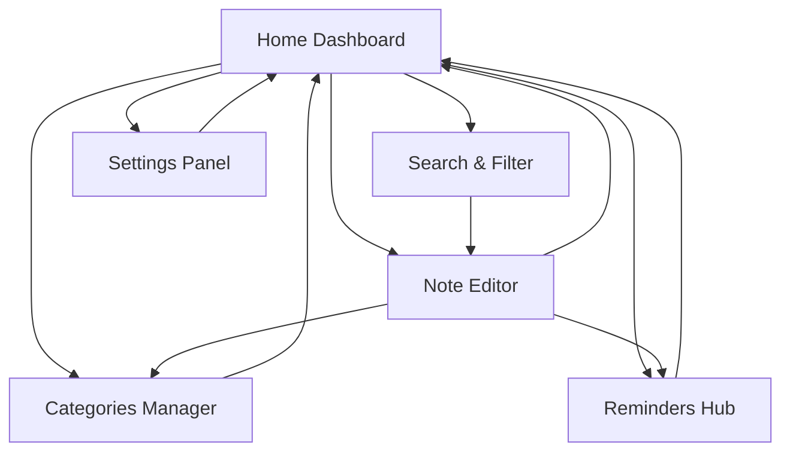

# Instant Notes - Product Requirements Document

## 1. Product Overview
Instant Notes is a comprehensive mobile note-taking application built with React Native and Expo, designed to provide users with a seamless, feature-rich experience for capturing, organizing, and managing their thoughts and ideas.

The app addresses the need for a modern, intuitive note-taking solution that combines powerful organization features with a clean, responsive interface. Target users include students, professionals, and anyone who needs to capture and organize information on-the-go.

The product aims to become the go-to mobile note-taking solution by offering advanced features like rich text editing, smart categorization, deadline management, and cross-platform synchronization.

## 2. Core Features

### 2.1 User Roles
| Role | Registration Method | Core Permissions |
|------|---------------------|------------------|
| Default User | Direct app access | Full access to all note-taking features, local storage, and basic functionality |

### 2.2 Feature Module
Our note-taking app consists of the following main pages:
1. **Home Dashboard**: note overview, quick actions, recent notes, search functionality
2. **Note Editor**: rich text editing, formatting tools, auto-save, media attachments
3. **Categories Manager**: folder creation, tag management, organization tools
4. **Reminders Hub**: deadline setting, notification management, priority levels
5. **Settings Panel**: theme selection, sync preferences, export/import options
6. **Search & Filter**: advanced search, filter by categories, date ranges

### 2.3 Page Details
| Page Name | Module Name | Feature description |
|-----------|-------------|---------------------|
| Home Dashboard | Note Overview | Display recent notes, favorites, and quick stats in card layout |
| Home Dashboard | Quick Actions | Create new note, voice memo, photo note buttons |
| Home Dashboard | Search Bar | Real-time search across all notes with suggestions |
| Note Editor | Rich Text Editor | Bold, italic, underline, bullet points, numbered lists, headers |
| Note Editor | Media Support | Insert images, voice recordings, and file attachments |
| Note Editor | Auto-save | Automatic saving every 30 seconds and on app background |
| Categories Manager | Folder System | Create, edit, delete folders with color coding |
| Categories Manager | Tag Management | Add, remove, and organize tags with auto-suggestions |
| Categories Manager | Archive System | Archive old notes with easy restoration |
| Reminders Hub | Deadline Setting | Set due dates and times for notes with calendar picker |
| Reminders Hub | Notification System | Push notifications for upcoming deadlines |
| Reminders Hub | Priority Levels | High, medium, low priority with visual indicators |
| Settings Panel | Theme Toggle | Dark mode, light mode, and system preference |
| Settings Panel | Data Management | Export notes to PDF/text, import from other apps |
| Settings Panel | Cloud Sync | Backup and sync across devices |
| Search & Filter | Advanced Search | Search by content, tags, categories, date ranges |
| Search & Filter | Filter Options | Filter by category, priority, date created/modified |

## 3. Core Process
The main user flow begins with accessing the Home Dashboard where users can view their recent notes and create new ones. From there, users can navigate to the Note Editor to create or modify content with rich text formatting and media attachments. The Categories Manager allows users to organize their notes into folders and apply tags for better organization. The Reminders Hub enables users to set deadlines and manage notifications for important notes. The Settings Panel provides customization options and data management features.

## 4. User Interface Design
### 4.1 Design Style
- **Primary Colors**: Blue (#007AFF) for primary actions, Gray (#8E8E93) for secondary elements
- **Secondary Colors**: Green (#34C759) for success states, Red (#FF3B30) for delete actions
- **Button Style**: Rounded corners (8px radius), subtle shadows, material design principles
- **Font**: System fonts (SF Pro on iOS, Roboto on Android) with sizes 14px-24px
- **Layout Style**: Card-based design with clean spacing, bottom tab navigation
- **Icons**: Feather icons for consistency, emoji support for categories

### 4.2 Page Design Overview
| Page Name | Module Name | UI Elements |
|-----------|-------------|-------------|
| Home Dashboard | Note Overview | Grid/list toggle, swipe gestures for quick actions, floating action button |
| Home Dashboard | Quick Actions | Prominent + button, voice/camera shortcuts with icons |
| Note Editor | Rich Text Editor | Toolbar with formatting options, markdown support, word count |
| Note Editor | Media Support | Drag-and-drop interface, thumbnail previews, attachment list |
| Categories Manager | Folder System | Hierarchical tree view, color picker, drag-to-organize |
| Reminders Hub | Deadline Setting | Calendar widget, time picker, recurring options |
| Settings Panel | Theme Toggle | Switch component with preview, system detection |

### 4.3 Responsiveness
The app is mobile-first with responsive design optimized for both phones and tablets. Touch interactions include swipe gestures for navigation, long-press for context menus, and pull-to-refresh functionality. The interface adapts to different screen sizes with flexible layouts and appropriate touch targets (minimum 44px).